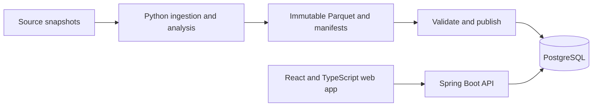

# MTG Scorer: portfolio product proposal

Reviewed: 2026-09-07. Direction adopted; milestone 2 delivered locally on 2026-09-08.
The proposal below preserves its original rationale; current implementation and
verification are in [the progress report](project-status-report.md).

Delivery update: the owner adopted this direction on 2026-09-07, including section
6 as acceptance criteria. [The active implementation sequence](implementation-plan.md)
and [ADR 0002](adr/0002-catalog-publication-and-delivery-order.md) reconcile roadmap
conflicts. [Milestone 1 findings](data-feasibility.md) distinguish verified catalog
access from unresolved tournament dependencies. The proposal/review text below
remains the rationale; adoption does not make its proposed capabilities implemented.

This proposal targets backend/full-stack SWE applications, with Java/Spring as
the main backend demonstration. Role emphasis and available hours are working
assumptions pending the owner's preferences. It proposes changes to sequencing
in the existing implementation plan; it does not silently supersede ADR 0001 or
the measurement contract. No application code was changed during this review.

## 1. Product and portfolio thesis

Build an explainable MTG card-discovery application: choose a card pool, find
cards with observed tournament use, and inspect the decks and evidence behind
each result. Forge remains the motivating use case and a useful preset, while
the first screen should make sense to a player unfamiliar with Forge.

The engineering story is a reproducible data pipeline feeding a reliable,
well-tested product API and an accessible web application. The distinctive
feature is that a recommendation can be traced to its observations, and those
observations remain stable across data refreshes.

Engineering quality is a first-class portfolio objective: readable code,
cohesive modules, explicit contracts, and intentional systems design must be
visible in the implementation and its decision history. Every delivery increment
includes design, verification, review, and refactoring. Section 6 defines the
engineering standard and the evidence required to demonstrate it.

Suggested one-sentence description:

> Discover cards for your available pool, with tournament evidence you can inspect.

Keep MTG Scorer as the working name. Naming work is not on the critical path.
Keep provisional analytical models available for research, but ship useful
observed statistics before making engine-discovery claims.

## 2. Current state, verified against the checkout

| Area | Present now | Gap before a portfolio release |
| --- | --- | --- |
| Python foundation | Validated factual types, provenance, independent coverage dimensions, feature containers, weighted scoring | Features are not computed from a real tournament corpus |
| Catalog ingestion | Scryfall download code, JSON/JSONL/gzip normalization, checksums, Oracle and printing Parquet outputs | Broader card-layout handling, failure tests, serving contract, full-size measurements |
| Java API | Java 21/Spring Boot, info, health, OpenAPI, sanitized errors, real HTTP tests | Catalog, persistence, meaningful business queries, publication integration |
| Product | Clear Forge/card-discovery motivation in documentation | No web app, usable discovery workflow, or deployed demo found |
| Delivery | Independent Python and Java CI jobs, Maven Wrapper, root Maven aggregator | Integrated pipeline-to-browser checks, deployment, operational evidence |
| Planning | Measurement contract and accepted language boundary | Several overlapping roadmaps, research-heavy sequencing, no release acceptance criteria |

Local verification on the review date: 20 Python tests passed; Ruff lint and
format checks passed; root Maven `verify` succeeded offline using the installed
JDK 21, including 10 HTTP integration tests. No full Scryfall download,
authenticated tournament query, production deployment, or browser product flow
was validated. Existing tests do not establish empirical score quality.

The working tree already contains modified documentation/CI, deleted old root
Python paths, and untracked `analytics/`, `api/`, and root Maven files. This
review includes those current files. Public-repository parity was not checked.
Reconcile and review that existing migration before preparing a release; do not
blindly stage the entire working tree.

## 3. Findings that should change the plan

### A. A useful screen is scheduled too late

The existing plan delays React until after substantial analytical work. Move a
real catalog screen into the first complete slice. Add observed tournament
statistics to that same product as the pipeline becomes available. This creates
an early way to assess usability and integration without waiting for clustering.

### B. Model completeness needs a public contract

A synthetic probe of `analytics/src/mtg_scorer/scoring.py:120` using only
commitment and competitive proof at 1.0, 10 decks, and 2 events produced:

- Build-around Signal: 100.0; feature coverage: 35.0%.
- Staple Score: 100.0; feature coverage: 25.0%.
- Evidence Score: 34.2.

This follows the current reweighting rule, but it cannot establish strategic
specificity. Empty input also returns numeric zero scores with zero coverage.
A consumer must not confuse those values with measured poor performance.

Introduce an explicitly versioned public result state such as `available`,
`insufficient_evidence`, or `not_applicable`, with a nullable estimate and reason
codes. Preserve unknown feature values. Require relevant strategy evidence before
showing a Build-around recommendation; volume alone cannot satisfy that gate.
The precise eligibility policy must be evaluated on the selected corpus, rather
than inventing a universal percentage threshold now.

First-release explanations should lead with counts, population, date range,
coverage, and example decks. Evidence Score is a heuristic, not a confidence
percentage. Compare derived scores only inside compatible cohorts and model
versions. Numeric research outputs can remain inspectable separately.

### C. Data availability is the first external dependency

TopDeck is a candidate, not yet a verified corpus. Its current documentation says
decklists can be URLs or text and that structured `deckObj` data is conditional.
API access requires a key and visible attribution, and limits vary by endpoint.
See the [official tournament API documentation](https://topdeck.gg/docs/tournaments-v2).

Before committing to the analytical release scope, inspect a bounded sample and
record event dates, format, usable decks, card-resolution rate, missing zones,
standings/match coverage, and permitted demo redistribution. Prefer a single
1v1 format for the initial model if suitable data is available. Do not choose a
format merely because its endpoint exists.

If the accessible data is predominantly singleton/multiplayer, revise commitment,
deck zones, and results semantics before using it. Copy count cannot discriminate
cards that all appear once; commanders need explicit representation. If only
top-cut lists are available, label statistics as usage among published lists.
Measured partial coverage does not itself establish an unbiased field estimate.

Timebox feasibility to roughly 8-12 working hours. If blocked, finish the real
catalog flow and use an appropriately permitted, curated real deck corpus for
the evidence demo. Synthetic fixtures remain test data, never tournament proof.
Do not silently turn a source failure into a broad scraping project.

### D. The catalog needs product-oriented normalization

`analytics/src/mtg_scorer/ingest/scryfall.py:310` projects top-level fields only.
A synthetic face-only card lost its face text and mana costs and projected empty
colors. The current fixture covers only two simple Oracle cards and a skipped
token. Layouts, faces, display image references, and card-name aliases need an
explicit policy before catalog detail and deck resolution are reliable.

Preserve card and face data separately where appropriate. Retain printing-level
set and rarity filters, and require one eligible printing to satisfy the selected
constraints together. A rare printing in an allowed set plus a common printing
in an excluded set must not incorrectly satisfy an allowed-set/common filter.
Treat Forge availability as its own versioned mapping when implemented; Scryfall
printing existence alone does not prove availability in an installed Forge build.

Do not advertise historical legality from current metadata. Keep pool selection
separate from the historical cohort used to compute evidence.

### E. Reliability is a stronger near-term investment than extra algorithms

The raw snapshot and checksum approach is worth keeping. Before scheduling jobs,
add interrupted-download/retry tests, failed normalization recovery, and clear
single-writer behavior. The normalizer currently stages data in an in-memory
DuckDB connection and inserts batches with `executemany`; streaming JSON is not
proof of bounded pipeline memory or adequate throughput. Benchmark a real bulk
snapshot before choosing an optimization.

At `analytics/src/mtg_scorer/domain.py:209`, `recorded_matches` sums partially
known wins/losses/draws with missing values treated as zero. Before using it as a
denominator, distinguish a complete total from a known subtotal. That is the kind
of correctness issue the first real adapter should expose and test.

## 4. First release: one complete user journey

1. Open a public demo without creating an account; select a prepared example or
   choose sets, rarity, and colors.
2. Search a real catalog and view cards with tournament evidence in one explicitly
   named format/date cohort. Offer evidence-based sorting and distinguish cards
   with no observed evidence.
3. Open a card and inspect eligible printings, observed usage, supporting decks,
   event coverage, and snapshot identity.
4. Adjust the pool and see which associated cards remain available. First show
   observed partner cards with support counts; do not promise an inferred engine
   package until the association method has been evaluated.
5. Copy a shareable discovery URL or export the filtered result and its snapshot
   identity. Save a pool locally without an account.

Design three main views: discovery, card/evidence detail, and dataset/methodology.
Use card art where available, legible typography, responsive controls, useful
empty/error/loading states, keyboard navigation, and text equivalents for visual
encodings. Keep the explanation understandable without reading the measurement
contract. Never display invented live counts or fabricated historical scores.

Authentication, cloud-saved pools, and owned-card imports follow after this read
path works. A public reviewer must always be able to use the demo as a guest.

## 5. Architecture and ownership

Retain the independent Python and Java applications. Add one web application and
one PostgreSQL database. Keep Java as a modular monolith organized by business
capability. A batch process and a product API justify separate runtimes here;
splitting catalog, scoring, and collections into microservices does not yet solve
an observed problem.



Use Next.js if public card pages and server rendering remain product goals.
Keep product rules in Spring; Next.js owns page composition and interaction.
A client-only React application is a reasonable simplification if those goals
are dropped. Do not maintain a second backend in frontend route handlers.

Start with explicit SQL through Spring JDBC for the analytical read path and
Flyway migrations. This makes pagination, indexes, and query plans visible and
reviewable. Add an ORM only if later transactional features benefit from it.
PostgreSQL is sufficient for the initial search and filters; measure before
adding a separate search engine or cache service.

Proposed layout, introduced incrementally when the corresponding code exists:

```text
analytics/src/mtg_scorer/
  domain.py, features.py, scoring.py
  ingest/                  source adapters
  normalize/               card resolution and canonical facts
  pipelines/               measured features and batch orchestration
  publish/                 validated serving exports
analytics/tests/
api/src/main/java/io/mtgscorer/api/
  catalog/  snapshots/  discovery/  config/  error/
api/src/main/resources/db/migration/
web/                       TypeScript/React application
contracts/                 publication schema and conformance fixtures
scripts/                   documented setup, demo seed, verification
deploy/                    container and deployment configuration
docs/                      product, ADRs, measurement, operations, benchmarks
```

Keep the root Maven aggregator for Java discovery. Do not force Python or web
builds into Maven. Add a small cross-platform entry point for demo setup and
verification. Pin Python/web dependency resolutions and document JDK/Python/Node
versions so a new checkout does not depend on this machine's installed tools.
Generate the TypeScript HTTP client from implemented OpenAPI rather than
hand-maintaining duplicate DTOs. Publication schemas and HTTP schemas have
different owners and should not be mistaken for one shared model.

## 6. Engineering quality and intentional systems design

The objective is code that another engineer can understand, verify, and change
with confidence. Judge design by correctness, clarity, cohesion, dependency
direction, and the scope of changes it enables. Pattern names, layer counts,
test counts, and file-size limits are not quality measures by themselves.

### A. Use a repeatable design process

For each substantive feature, work through the following sequence before and
during implementation. A short feature note or PR description is sufficient for
a small change; changes to ownership, persistence, consistency, or public
contracts merit a durable design note or ADR.

1. **Define the problem.** State the user journey, observable acceptance criteria,
   scope exclusions, and constraints. Distinguish known requirements from
   assumptions that need a sample, prototype, or measurement.
2. **Model the domain.** Name the concepts, identities, invariants, states, and
   transitions. Separate a printing from an Oracle card, a dataset from a
   publication attempt, and unavailable evidence from a measured zero.
3. **Specify quality requirements.** Identify relevant latency, workload, storage,
   freshness, consistency, recovery, and cost expectations. Estimate read/write
   patterns and data growth before choosing indexes, batch sizes, or caching.
   Record the assumptions and how they will be tested.
4. **Compare viable designs.** Include the simplest workable option. Evaluate
   correctness, implementation effort, operational burden, and expected change.
   Record the selected tradeoff, its consequences, and a condition for revisiting it.
5. **Define boundaries and contracts.** Identify the owning module, inputs,
   outputs, error semantics, schema evolution, and any transaction boundary.
   For stateful workflows, describe retries, concurrent operations, partial
   failure, and recovery before choosing the implementation structure.
6. **Implement one complete slice.** Establish a representative path through
   input validation, application behavior, persistence, and presentation. Use it
   to review the design before repeating the structure across more features.
7. **Verify and refine.** Check acceptance criteria and failure cases, inspect the
   dependency direction, measure relevant behavior, and refactor confusing
   names or abstractions. Update the design record to match the delivered code.

Maintain a small system context/container diagram. Add a sequence diagram for
publication and an entity/state model where identity or concurrency is subtle.
Each diagram should answer a concrete question and reference its implementation
or contract. Avoid generating a separate design document for routine formatting
or a straightforward local correction.

### B. Make architectural boundaries enforceable

Organize the Java application by business capability, with internal separation
where behavior warrants it. Apply ports-and-adapters principles to meaningful
external dependencies; keep simple queries direct and easy to follow.

| Boundary | Responsibility and dependency rule |
| --- | --- |
| Domain logic | Own identities, invariants, and analytical rules; no HTTP, SQL, file access, or framework lifecycle dependency |
| Application use cases | Coordinate domain operations, transaction scope, and external capabilities; expose explicit inputs and results |
| HTTP/CLI adapters | Parse and validate transport input, invoke application behavior, and translate results/errors |
| Persistence/source adapters | Own SQL, row/payload mapping, network/file access, and source-specific behavior |
| Composition/configuration | Construct concrete dependencies and load validated configuration |
| Web features | Own interaction and presentation; consume the API contract without reproducing scoring or authoritative eligibility rules |

Interfaces belong at a boundary when they express a useful capability or isolate
an external dependency. Do not create an interface and implementation for every
class. Keep persistence records, external payloads, domain objects, and public
DTOs distinct where their semantics or evolution differ; avoid mechanical copies
when the models actually have the same contract.

For example, publication orchestration uses a serving-store capability implemented
by a PostgreSQL adapter. The domain expresses valid snapshot states; the adapter
enforces the atomic database transition. A catalog query can use a focused SQL
read adapter without reconstructing an unnecessary object graph.

Within Java, modules expose small public entry points and keep implementation
details internal. Cross-module calls use those entry points; a module must not
reach into another module's repository internals. Keep module dependencies
acyclic. In Python, retain pure feature/scoring transformations and place I/O
coordination in pipeline/adapter modules. Java continues to consume published
results rather than owning a second scoring implementation.

Add automated dependency checks once these boundaries exist: domain code must
not import HTTP/database adapters, modules must not form cycles, and forbidden
cross-module access must fail CI. These checks supplement a readable package
structure and design review.

### C. Define concrete code-writing standards

- Use domain-specific names consistently across code, schemas, tests, and docs.
  Prefer `eligible_deck_count` and `catalog_snapshot_id` over ambiguous `count`,
  `data`, or `version`. Name units and time semantics explicitly.
- Keep functions and classes focused on a coherent responsibility. Separate
  calculation from I/O, and prefer straightforward control flow. Extract helpers
  when they name a meaningful operation; avoid fragmenting a readable flow merely
  to shorten methods.
- Use type annotations for Python application boundaries and strict TypeScript
  checking. Model Java inputs/results explicitly. Keep untyped external payloads
  inside adapters and validate them before constructing internal values.
- Express invalid states through constructors, value types, or explicit state
  variants where useful. Preserve unknown values, reject non-finite numerical
  inputs, and distinguish an empty result from a failed operation.
- Prefer immutable inputs/results and local state. Pass dependencies explicitly;
  avoid hidden service lookup and mutable global configuration. Supply clocks
  and other nondeterministic inputs when a use case requires reproducible behavior.
- Keep error handling intentional. Preserve causes, translate errors at their
  owning boundary, and catch only failures the code can handle. Never catch a
  batch error and silently present partial output as a successful publication.
- Centralize shared business rules under one owner. Apply DRY to duplicated
  knowledge; introduce reuse when semantics are stable. Similar-looking source
  adapters can remain separate if their rules are different.
- Apply SOLID through cohesion, narrow capabilities, and composition. Require a
  concrete reason for inheritance, a generic framework, or an additional layer.
  Favor the simplest design that satisfies the known constraints.
- Write comments for intent, invariants, non-obvious tradeoffs, and external
  constraints. Public contracts need documentation; obvious control flow does
  not need narration. Remove obsolete comments and dead code as behavior changes.
- Keep SQL readable and parameterized, with explicit columns, constraints, and
  transaction scope. Tie indexes to actual queries and inspect representative
  query plans. Keep schema/data migrations reviewable and compatible with the
  deployment sequence.
- In React, keep cohesive feature components, separate remote data from local
  interaction state, and derive values instead of synchronizing duplicate state.
  Model loading, empty, failure, and success states explicitly. Keep accessibility
  and user-visible terminology part of normal component design.

Document formatter/linter choices for all three languages and automate them in
CI. Preserve Ruff for Python and establish consistent Java and TypeScript checks
when those slices are introduced. Add static analysis for useful defect classes;
keep suppressions narrow and explained. Do not use an arbitrary coverage or
complexity score as a substitute for reviewing the behavior.

### D. Design tests around contracts and failure modes

Use fast unit tests for pure rules, adapter integration tests for actual I/O
semantics, and a small set of complete user journeys. Tests should explain the
behavior with clear setup and assertions and allow implementation refactoring.
Mock external boundaries when isolation is useful; avoid mocking the entire
internal call graph. Cover observed defects with regression tests.

Start with risky invariants: unknown evidence remains unknown, printing filters
refer to the same printing, duplicate publication is harmless, and failed
publication cannot expose partial data. For applicable rules, use generated
inputs or properties such as bounded scores and deterministic results under a
fixed input/configuration. Verify database transactions and concurrency against
the real database. The workload-specific checks in section 9 remain required.

### E. Make methodical work visible in reviews

Keep changes cohesive and reviewable. Separate a structural refactor from a
behavior change when that makes verification clearer. Before completing a
substantive feature, answer:

- Is the problem and resulting user behavior clear, with explicit scope?
- Does every business rule have an identifiable owner, with valid dependencies?
- Are inputs, identities, units, absence, errors, and state transitions explicit?
- Are relevant resource bounds, transaction scope, retry behavior, and concurrent
  operations accounted for?
- Do tests establish the important contract and failure behavior?
- Can an unfamiliar engineer follow the names and main execution path?
- Are abstractions justified, and have unnecessary branches or duplication of
  business knowledge been removed?
- Do schema/API compatibility, configuration, operational visibility, and rollback
  need changes, and are the relevant docs current?

Record remaining debt with its consequence and revisit trigger. Review the final
diff and relevant checks before treating the feature as complete. PR descriptions
should capture the problem, decision, validation, and material limitations.

### F. Demonstrate maintainability with realistic change scenarios

Use the implemented slices to assess these scenarios; they are review exercises,
not instructions to build speculative features:

| Change scenario | Evidence that the design contains the change |
| --- | --- |
| Add a second tournament source | New adapter/mapping and conformance fixtures; factual/scoring semantics remain source-independent |
| Revise scoring weights or eligibility | Versioned Python configuration/policy and evaluated outputs; no duplicate formula changes in Java or React |
| Extend a printing filter | Focused query/contract/UI changes; no rewrite of ingestion orchestration or unrelated features |
| Replace file-backed test storage with PostgreSQL publication | Application contract is preserved; adapter integration tests verify the new transaction semantics |
| Diagnose a failed refresh | Snapshot/job identity links logs and validation results; recovery follows the documented state transitions |

If a scenario legitimately changes a public contract, evolve it explicitly and
update its consumers. The goal is predictable, justified change, not a promise
that every extension touches exactly one file. Include one concrete design
evolution with before/after reasoning in the portfolio case study.

## 7. Make publication the signature engineering feature

Use versioned catalog rows and immutable analytical snapshots. A score snapshot
references the exact catalog snapshot, source manifests, feature pipeline,
model/config identity, and publication schema version that produced it.

Suggested entities: catalog snapshots, Oracle cards, faces, printings, analytical
snapshots, card observations, derived estimates, and bounded evidence references.
Keep the complete raw corpus in the analytical store; publish only what product
queries need. Use composite keys including snapshot identity where necessary.

Publication protocol:

1. Write a new staging snapshot under a unique ID; do not overwrite published rows.
2. Validate supported schema version, checksums, unique keys, foreign keys,
   expected counts, and eligibility rules. Quarantine unresolved deck/card IDs.
3. Mark the snapshot ready and atomically promote its active pointer in a database
   transaction. Serialize publishers or use a guarded update to avoid races.
4. Resolve one snapshot per request. Include that ID in responses, exports, and
   pagination cursors so follow-up requests do not mix versions.
5. Retain the prior published snapshot for rollback. Failed publication leaves it
   available, and retrying the same batch does not duplicate records.

Keep schema migrations owned in one place under the API. The Python publisher
targets the documented schema and must pass cross-language conformance tests.
Give publication and API processes distinct database permissions. Collection
writes, if introduced, should not permit mutation of published analytical rows.

Suggested initial API resources: paginated catalog search, card/printing detail,
snapshot metadata, and card evidence scoped to a snapshot. Add score sorting only
when eligible estimates exist. Bound page sizes; whitelist sort keys; use a stable
tie-breaker. Snapshot-pinned keyset pagination is a useful choice for ranked
results, with cursor validation covering sort and filter identity.

An especially useful demonstration is a deliberately failed batch: the old data
remains queryable, the failure is diagnosable, and a corrected rerun publishes once.

## 8. Delivery sequence and acceptance gates

The original effort ranges below are a rough baseline, not commitments. They
predate the expanded engineering-quality outline and need revision after the
first design exercise and representative implementation slice. Budget design,
review, refactoring, and verification inside each increment. Reduce feature scope
or extend the schedule when needed to meet these gates; do not defer engineering
quality to a final cleanup phase. No delivery deadline has been agreed.

| Increment | Approximate effort | Concrete exit condition |
| --- | --- | --- |
| 1. Data feasibility and product contract | 8-12 h | One reviewed source sample, chosen cohort, resolution/coverage report, demo data policy, three-view wireframe, explicit score eligibility proposal |
| 2. Catalog from ingestion to screen | 24-32 h | Versioned publication, PostgreSQL migrations, search/detail API, real web discovery screen, fixture seed, integrated CI, first hosted preview |
| 3. Traceable tournament evidence | 16-24 h | One adapter/corpus, tested card resolution, observed statistics, evidence page, eligibility states, shareable snapshot-pinned results |
| 4. Publication and query reliability | 16-24 h | Failure/retry/rollback tests, stable pagination across refresh, representative load measurements, structured logs and useful readiness |
| 5. Portfolio release | 16-24 h | Accessible/mobile flows checked, reproducible demo setup, public deployment, restore exercise, concise README, demo video and engineering case study |

Engineering evidence accompanies the functional exit conditions:

| Increment | Required design and code-quality evidence |
| --- | --- |
| 1 | Shared vocabulary, invariants, workload assumptions, context diagram, and a short comparison of the publication options |
| 2 | Reviewed reference slice, documented module dependencies, language checks, publication contract tests, and justified schema/query design |
| 3 | Explicit missingness/eligibility policy, source-boundary checks, pure transformation tests, and readable evidence mapping |
| 4 | Publication state/sequence model, transaction/concurrency tests, measured resource bounds, and justified reliability changes |
| 5 | Change-scenario review, current ADRs/diagrams, onboarding verification, and an engineering case study tied to delivered code |

Increment 2 is the early demo checkpoint; a catalog alone is not the completed
flagship. Increment 3 supplies the distinctive product value. If source access
fails, change the release's claims and scope explicitly instead of waiting
indefinitely for a research pipeline.

The first implementation ticket should be the bounded data feasibility report,
not another architectural abstraction. Its output must answer whether real card
identities and evidence can support the intended user journey.

After the core release, choose one extension according to target roles:

- Backend emphasis: authenticated cloud-saved pools, transactional edits,
  ownership enforcement, and concurrent-update handling. Estimate another
  12-24 hours plus identity-provider setup. Reuse established authentication
  support; test that one user cannot access another user's data.
- Full-stack emphasis: pool import with a correction preview, refined comparison,
  accessibility, and observed user feedback.
- Data emphasis: regularized partner discovery, sensitivity analysis, and
  event/time-based evaluation with leakage prevention.

## 9. Verification and operations that demonstrate engineering depth

Extend tests around consequential behavior, not a target test count:

- Python: real adapter edge cases; unknown versus zero; eligibility and denominator
  rules; face/name resolution; checksum corruption; interrupted ingestion; idempotency.
- Database/API: real PostgreSQL migrations and queries; joint printing filters;
  limits/errors; snapshot consistency; duplicate/rejected publication; failed
  promotion. Spring Boot supports service connections for Testcontainers; use
  that integration instead of substituting a database with different SQL behavior.
  See [Spring Boot Testcontainers](https://docs.spring.io/spring-boot/reference/testing/testcontainers.html).
- Cross-language: Python publishes a known fixture into PostgreSQL, Java serves it,
  and the resulting values and snapshot identities match the publication contract.
- Browser: guest discovery, filters, card evidence, empty/error states, and shared
  URLs. Prefer user-visible behavior and accessible locators as described in
  [Playwright's testing guidance](https://playwright.dev/docs/best-practices).
- Evaluation: manually inspect representative cards and adverse cases before
  tuning weights. Separate tuning examples from evaluation events/time windows.
  Sentinel checks detect regressions but are not proof of model accuracy.

Keep normal CI deterministic and independent of live external APIs. Run source
refresh separately against credentials provided through deployment configuration.
Build and deploy versioned artifacts, run a smoke check, and document rollback.
Start with a scheduled batch command; orchestration platforms are unnecessary here.

Track request count/error rate/latency, batch duration/status, publication row
counts, unresolved card rate, and served dataset identity/age. Distinguish process
liveness from readiness to serve a valid dataset. An upstream outage should leave
the last good dataset available with its actual timestamp.

For a modest deployment, use a containerized API, managed PostgreSQL, web hosting,
and durable artifact storage as needed. Choose the provider after confirming the
hosting budget and runtime requirements. Define backups, retention, and a tested
restore procedure. Maintain a small deployment description/runbook; automate the
chosen resources when that makes rebuilds simpler.

Suggested benchmark target to validate or revise: catalog/detail p95 below 300 ms
at 20 concurrent readers on a named deployment tier and a documented dataset,
excluding browser asset loads. Record request count, duration, errors, warm/cold
conditions, data size, and query plans. Separately measure import throughput and
peak memory. These are proposed experiments, not achieved performance claims.

## 10. Portfolio presentation and completion criteria

Replace the long README opening with the user problem, live demo, one screenshot,
a short demonstration, and concise setup. Move detailed methodology into its
existing document. Use one delivery plan as the roadmap, ADRs for decisions, and
a changelog for completed work rather than maintaining three overlapping lists.

Provide a small demo dataset that can legally be redistributed, requires no API
key to run, and is explicitly identified as real or synthetic. Omit unnecessary
player identifiers and private source fields from public artifacts. Decide the
code license deliberately; third-party data and card imagery require their own
attribution/reuse treatment.

Release acceptance:

- A visitor can discover a card and understand its evidence in a short guest flow.
- A new checkout can start the documented demo without production credentials.
- A displayed observation can be traced to a dataset and reproducible input.
- Absence of eligible evidence is displayed explicitly, with no fabricated rank.
- A bad refresh does not break the currently served snapshot.
- CI exercises at least one complete publication-to-browser journey.
- Actual performance and operating cost are recorded with measurement conditions.
- Deployment, rollback, and data restore have been exercised.
- Code passes the section 6 review criteria, with automated checks for implemented
  architectural boundaries and relevant static analysis.
- Design records explain the consequential tradeoffs and match the delivered
  code; at least one realistic change scenario has been reviewed.
- README, screenshots, and release artifacts describe only delivered capabilities.

Write a brief engineering case study around three decisions: separating batch
computation from HTTP serving; preserving availability during publication failure;
and displaying uncertainty without hiding useful observations. Gather feedback
from a few real players and document what changed as a result. No hiring outcome
can be promised, but these provide concrete decisions and evidence to discuss.

Future resume wording, to use only after the claims are demonstrated:

> Built and deployed an MTG discovery application using Java/Spring Boot,
> PostgreSQL, Python, and React, with reproducible data snapshots and traceable
> tournament evidence.

> Designed atomic, idempotent dataset publication with rollback and validated
> cross-language contracts through database integration and browser tests.

Add measured scale or latency only when recorded; do not turn targets into results.

## 11. Explicitly deferred

Multiple tournament sources, decades of historical legality, causal engine
classification, advanced clustering, a deck optimizer, social features, payments,
and an AI chat interface are outside the first release. Kafka, Kubernetes,
additional microservices, Redis, and a separate search cluster require a concrete
need before introduction. Authentication follows the useful guest flow.

The primary changes are the delivery sequence, evidence standard, and explicit
engineering-quality gates. The existing language boundary, domain separation,
and snapshot foundation remain useful.
